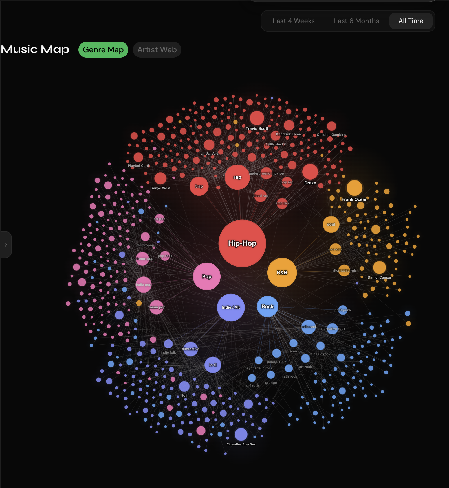
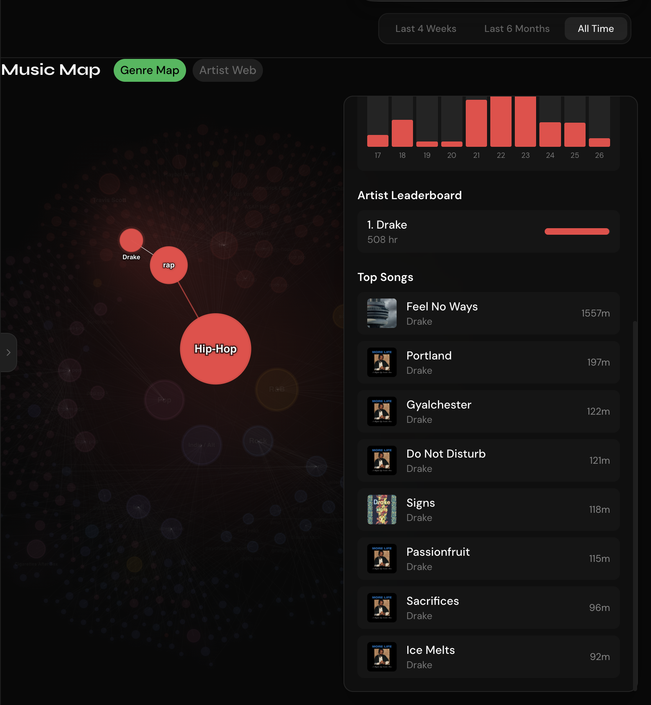

<div align="center">

# SpotYourVibe

**Turn Spotify listening history into a living taste graph.**

SpotYourVibe is a full-stack music intelligence app that maps genres, subgenres, artists, tracks, and listening history as an interactive second brain for your music taste.

[](https://fastapi.tiangolo.com)
[](https://nextjs.org)
[](https://supabase.com)
[](https://developer.spotify.com/documentation/web-api)
[](LICENSE)

</div>

---

## Status

SpotYourVibe is in active local development. There is no public hosted demo yet, so the screenshots below show the current graph experience without requiring a Spotify login, Supabase project, or local setup.

## Preview

### Music Map

The Music Map organizes listening data as a layered graph: parent genres in the center, subgenres around them, and artists on the outer edge. Node size and glow reflect listening weight, while color regions show genre families.



### Node Details

Clicking a genre, subgenre, or artist pins the selection and opens a detail panel with listening history, artist rankings, subgenre mix, and top songs with Spotify artwork.



## What It Does

SpotYourVibe connects to Spotify through OAuth, imports or syncs listening data, enriches artists with genre metadata, and turns that data into visual tools for understanding taste over time.

Core product goals:

- Show music taste as a connected graph instead of a static stats page.
- Make genres, subgenres, artists, and tracks feel spatially related.
- Rank music by actual listening history where available, not only Spotify's opaque top-item ordering.
- Help users discover patterns in their listening, including genre clusters, artist leaders, top songs, yearly trends, and recommendation paths.

## Features

| Feature | Description |
|---|---|
| **Spotify OAuth** | Connect a Spotify account and store a session with JWT-based auth. |
| **Music Map** | Interactive D3/canvas graph of parent genres, subgenres, and artists. |
| **Pinned Node Details** | Click nodes to inspect listening time, yearly history, leaderboards, subgenre mix, and top songs. |
| **Artist Top Songs** | Aggregates all-time listening history for selected artists and merges duplicate Spotify versions of the same song. |
| **Album Artwork** | Enriches top-song rows with stored Spotify artwork or live Spotify lookups. |
| **Top Tracks & Artists** | Dashboard views for ranked tracks and artists across Spotify time ranges. |
| **Listening History Import** | Import Spotify Extended Streaming History JSON exports for deeper all-time stats. |
| **Genre Enrichment** | Combines Spotify artist genres with Last.fm fallback tags, then cleans noisy tags. |
| **Recommendations** | Personalized recommendations based on saved taste data and Spotify seeds. |
| **History Analytics** | Lifetime stats, yearly trends, heatmaps, and listening patterns. |

## Architecture

```text
spotify_sql_project/
├── api/                         # FastAPI backend
│   ├── app/
│   │   ├── auth/                # Spotify OAuth, refresh-token handling, JWT sessions
│   │   ├── users/               # User profile and sync metadata
│   │   ├── tracks/              # Top track sync and read endpoints
│   │   ├── artists/             # Top artist sync and read endpoints
│   │   ├── genres/              # Genre distribution endpoints
│   │   ├── map/                 # Genre map and artist graph data
│   │   ├── history/             # Streaming history stats and top-song aggregation
│   │   ├── import_/             # Spotify history JSON import
│   │   └── recommendations/     # Recommendation pipeline
│   ├── scripts/                 # Import and genre-enrichment scripts
│   ├── supabase/                # Supabase schema and RPC helpers
│   └── requirements.txt
├── web/                         # Next.js 14 frontend
│   ├── app/                     # App Router pages
│   ├── components/              # Dashboard, map, chart, and UI components
│   ├── hooks/                   # SWR data hooks
│   └── lib/                     # API client, auth helpers, shared types
└── docs/screenshots/            # README preview images
```

## Tech Stack

**Frontend**

- Next.js 14 App Router
- TypeScript
- Tailwind CSS
- D3 for the Music Map canvas simulation
- Recharts for dashboard charts
- SWR for authenticated API data fetching

**Backend**

- FastAPI
- Supabase/Postgres
- Spotipy / Spotify Web API
- Last.fm API for fallback genre enrichment
- JWT sessions

## Local Setup

### Prerequisites

- Python 3.9+
- Node.js 18+
- Supabase project
- Spotify Developer app
- Last.fm API key for fallback genre enrichment

### 1. Clone

```bash
git clone <your-repo-url>
cd spotify_sql_project
```

### 2. Set Up Supabase

Run the schema in Supabase SQL editor:

```text
api/supabase/schema.sql
```

Then run any migrations in:

```text
api/migrations/
```

### 3. Configure the API

```bash
cd api
python3 -m venv venv
source venv/bin/activate
pip install -r requirements.txt
cp .env.example .env
```

Fill in `.env`:

```env
SPOTIFY_CLIENT_ID=your_client_id
SPOTIFY_CLIENT_SECRET=your_client_secret
SPOTIFY_REDIRECT_URI=http://127.0.0.1:8000/api/v1/auth/callback
SUPABASE_URL=https://your-project.supabase.co
SUPABASE_SERVICE_KEY=your_service_role_key
JWT_SECRET=a_long_random_secret
FRONTEND_URL=http://localhost:3000
LASTFM_API_KEY=your_lastfm_api_key
```

In the Spotify Developer Dashboard, the redirect URI must exactly match:

```text
http://127.0.0.1:8000/api/v1/auth/callback
```

Run the API:

```bash
python3 -m uvicorn app.main:app --host 127.0.0.1 --port 8000 --reload
```

API docs are available at:

```text
http://127.0.0.1:8000/docs
```

### 4. Configure the Frontend

```bash
cd web
npm install
cp .env.local.example .env.local
```

Set:

```env
NEXT_PUBLIC_API_URL=http://127.0.0.1:8000/api/v1
```

Run the frontend:

```bash
npm run dev
```

Open:

```text
http://localhost:3000
```

Use one browser origin consistently while testing auth. `localhost:3000` and `127.0.0.1:3000` have separate browser storage, so switching between them can make the app look logged out.

## Importing Spotify Listening History

The richest graph views come from Spotify Extended Streaming History exports.

1. Request data from Spotify at `spotify.com/account/privacy`.
2. Download the Extended Streaming History export when Spotify emails it.
3. Import and enrich it:

```bash
cd api
python3 scripts/import_history.py --dir "/path/to/Spotify Extended Streaming History"
python3 scripts/enrich_artist_genres.py
python3 scripts/enrich_lastfm_genres.py
python3 scripts/clean_genre_tags.py
```

## Data Pipeline

```text
Spotify OAuth
  -> authenticated user row in Supabase
  -> top tracks / top artists sync
  -> optional extended history import
  -> Spotify + Last.fm genre enrichment
  -> cleaned genre families and subgenre tags
  -> map/history/recommendation API endpoints
  -> Next.js dashboard and interactive Music Map
```

The Music Map uses layered graph logic:

- Parent genres anchor the inner layer.
- Subgenres sit around the parent genre layer.
- Artists sit in an outer, organic blob-like field.
- Hovering highlights local relationships.
- Clicking pins a node and opens the listening detail panel.

## API Overview

All API routes are prefixed with `/api/v1`.

| Area | Routes |
|---|---|
| Auth | `GET /auth/login`, `GET /auth/callback`, `POST /auth/logout` |
| Users | `GET /users/me` |
| Tracks | `GET /tracks`, `POST /tracks/sync` |
| Artists | `GET /artists`, `POST /artists/sync` |
| Genres | `GET /genres` |
| Map | `GET /map/genre`, `GET /map/artists` |
| History | `GET /history/stats`, `GET /history/yearly`, `GET /history/top-tracks`, `GET /history/artist-top-tracks` |
| Recommendations | `GET /recommendations` |
| Import | Streaming history import/status endpoints |

Protected routes require:

```text
Authorization: Bearer <jwt>
```

## Security Notes

- Do not commit `.env`, `.env.local`, `.cache`, `.claude/`, `.agents/`, `AGENTS.md`, `CODEX.md`, or database files.
- Supabase service role keys belong only in the backend `.env`.
- Spotify refresh tokens are stored server-side in Supabase and should never be exposed to the frontend.
- The screenshots in this README are for UI demonstration and may reflect development listening data. Replace them with anonymized/demo data before a public launch if that matters for your release.

## Roadmap

- Add a public demo dataset mode.
- Build a true per-genre/per-year history endpoint instead of weighted global history approximations.
- Add stronger recommendation explanations from graph neighborhoods.
- Improve mobile interaction for dense graph exploration.
- Add tests around history aggregation, duplicate track normalization, and map filtering.

## Acknowledgments

- [Spotify Web API](https://developer.spotify.com/documentation/web-api/)
- [Last.fm API](https://www.last.fm/api)
- [Spotipy](https://github.com/plamere/spotipy)
- [Supabase](https://supabase.com)
- [Next.js](https://nextjs.org)
- [D3](https://d3js.org)

---

<div align="center">
<sub>MIT License · Built with FastAPI, Next.js, Supabase, and Spotify data</sub>
</div>
